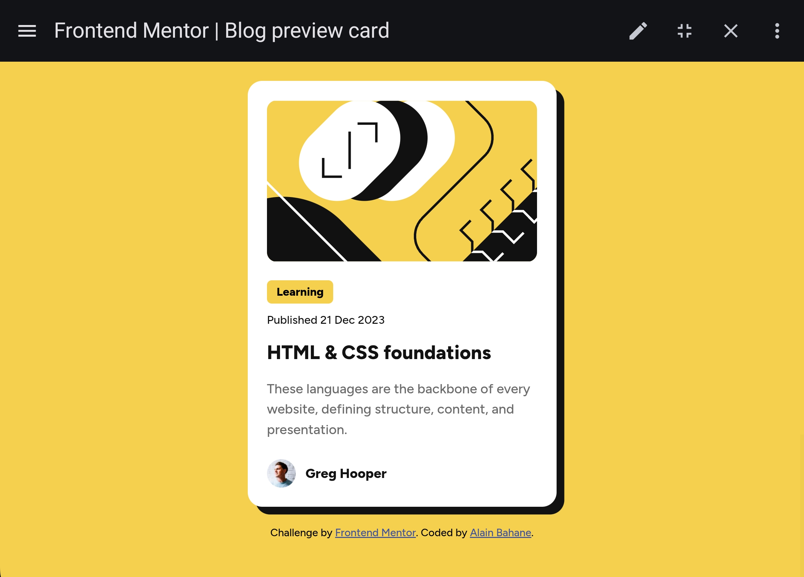

# Frontend Mentor - Blog preview card solution

This is a solution to the [Blog preview card challenge on Frontend Mentor](https://www.frontendmentor.io/challenges/blog-preview-card-ckPaj01IcS).  
Frontend Mentor challenges help improve coding skills by building realistic projects.


## Table of contents

- [Overview](#overview)
  - [The challenge](#the-challenge)
  - [Screenshot](#screenshot)
  - [Links](#links)
- [My process](#my-process)
  - [Built with](#built-with)
  - [What I learned](#what-i-learned)
  - [Continued development](#continued-development)
  - [AI Collaboration](#ai-collaboration)
- [Author](#author)
- [Acknowledgments](#acknowledgments)


## Overview

### The challenge

Users should be able to:

- See hover and focus states for all interactive elements on the page


### Screenshot




### Links

- Solution URL: [GitHub Repository](https://github.com/FreeDev-Group/blog-preview-card-main-Alain.git)
- Live Site URL: [View Live Site](#)


## My process

### Built with

- Semantic HTML5 markup
- CSS custom properties
- Flexbox
- Mobile-first workflow


### What I learned

This project helped me strengthen my understanding of structuring clean and semantic HTML. I also improved my ability to style components using CSS variables and Flexbox.

Example of clean structure:

```html
<article class="card">
  <h1 class="card__title">HTML & CSS foundations</h1>
</article>
```

Example of styling:

```css
.card {
  padding: 20px;
  border-radius: 15px;
  box-shadow: 8px 8px 0 black;
}
```

### Continued development

In future projects, I want to:

- Improve responsiveness across all screen sizes
- Get more comfortable with CSS positioning and layouts
- Write cleaner and more scalable CSS (BEM methodology)
- Start integrating JavaScript for interactivity


### AI Collaboration

I used ChatGPT during this project to:

- Help structure the HTML and CSS properly
- Debug layout and styling issues
- Improve code organization and best practices

What worked well:
- Faster problem solving  
- Better understanding of clean code structure  

What didn’t:
- Sometimes I relied too much on suggestions instead of thinking deeply first  

## Author

- Frontend Mentor - [@alainbahanep](https://www.frontendmentor.io/profile/alainbahanep)
- GitHub - [FreeDev-Group](https://github.com/FreeDev-Group)


## Acknowledgments

Special thanks to **Salomon Mwilo** and **FreeDev Group** for their guidance and support throughout this project.